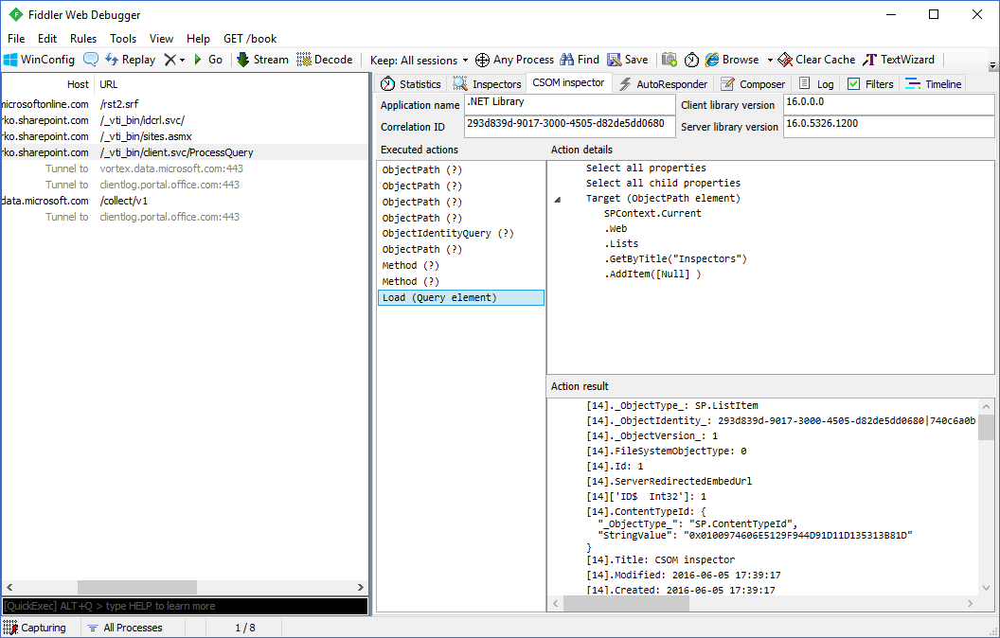

# CSOM Inspector

Fiddler extension for SharePoint CSOM communication inspection.

### Requirements

* Fiddler 4
* Visual Studio Community Edition
* .NET Framework 4.0
* C# 6.0 compiler

### Installation

Extract all dlls directly to `%USERPROFILE%\Documents\Fiddler2\Scripts` folder.